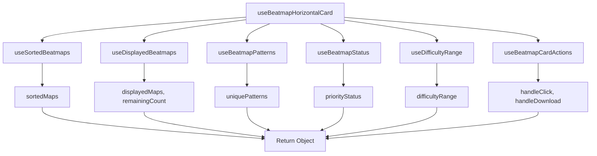

# useBeatmapHorizontalCard Hook

A molecular hook that orchestrates all the logic needed for the BeatmapHorizontalCard component.

## Purpose

This hook combines multiple atomic hooks to provide a complete data and action interface for the BeatmapHorizontalCard component. It handles data processing, state management, and user interactions.

## Signature

```typescript
const useBeatmapHorizontalCard = (
  beatmapset: BeatmapsetCompleteShort
) => BeatmapHorizontalCardData
```

## Parameters

| Parameter | Type | Description |
|-----------|------|-------------|
| `beatmapset` | `BeatmapsetCompleteShort` | Complete beatmapset data |

## Returns

- **Type**: `BeatmapHorizontalCardData`
- **Description**: Complete card data and actions

```typescript
interface BeatmapHorizontalCardData {
  // Data
  sortedMaps: BeatmapCompleteShort[];
  displayedMaps: BeatmapCompleteShort[];
  remainingCount: number;
  uniquePatterns: string[];
  priorityStatus: BeatmapStatus;
  difficultyRange: { minRating: number; maxRating: number } | null;
  
  // Actions
  handleClick: () => void;
  handleDownload: (e: React.MouseEvent) => void;
}
```

## Usage

### Basic Usage
```typescript
import { useBeatmapHorizontalCard } from '@/hooks/molecules';

const BeatmapHorizontalCard = ({ beatmapset }) => {
  const {
    displayedMaps,
    remainingCount,
    uniquePatterns,
    priorityStatus,
    difficultyRange,
    handleClick,
    handleDownload
  } = useBeatmapHorizontalCard(beatmapset);

  return (
    <div onClick={handleClick}>
      {/* Render card content */}
    </div>
  );
};
```

### In Component
```typescript
const BeatmapHorizontalCard = ({ beatmapset }) => {
  const cardData = useBeatmapHorizontalCard(beatmapset);

  if (!beatmapset.beatmapset || !cardData.difficultyRange) {
    return null;
  }

  return (
    <div className="beatmap-card" onClick={cardData.handleClick}>
      <BeatmapCover beatmapset={beatmapset} />
      <BeatmapActions 
        beatmapset={beatmapset} 
        onDownload={cardData.handleDownload} 
      />
      
      <div className="content">
        <BeatmapBadges
          displayedMaps={cardData.displayedMaps}
          remainingCount={cardData.remainingCount}
          uniquePatterns={cardData.uniquePatterns}
        />
        
        <BeatmapInfo beatmapset={beatmapset} />
        
        <BeatmapFooter
          priorityStatus={cardData.priorityStatus}
          minRating={cardData.difficultyRange.minRating}
          maxRating={cardData.difficultyRange.maxRating}
        />
      </div>
    </div>
  );
};
```

## Implementation Details

### Hook Composition
The hook combines multiple atomic hooks:

```typescript
export const useBeatmapHorizontalCard = (beatmapset: BeatmapsetCompleteShort) => {
  // Sort beatmaps by difficulty
  const sortedMaps = useSortedBeatmaps(beatmapset.beatmap);
  
  // Get displayed maps and remaining count
  const { displayedMaps, remainingCount } = useDisplayedBeatmaps(sortedMaps);
  
  // Get unique patterns
  const uniquePatterns = useBeatmapPatterns(sortedMaps);
  
  // Get priority status
  const priorityStatus = useBeatmapStatus(sortedMaps);
  
  // Get difficulty range
  const difficultyRange = useDifficultyRange(sortedMaps);
  
  // Get actions
  const { handleClick, handleDownload } = useBeatmapCardActions(beatmapset, sortedMaps);

  return {
    sortedMaps,
    displayedMaps,
    remainingCount,
    uniquePatterns,
    priorityStatus,
    difficultyRange,
    handleClick,
    handleDownload
  };
};
```

### Data Flow


## Examples

### Complete Card Implementation
```typescript
const BeatmapHorizontalCard = ({ beatmapset }) => {
  const {
    displayedMaps,
    remainingCount,
    uniquePatterns,
    priorityStatus,
    difficultyRange,
    handleClick,
    handleDownload
  } = useBeatmapHorizontalCard(beatmapset);

  if (!beatmapset.beatmapset || !difficultyRange) {
    return null;
  }

  return (
    <div
      className="card bg-base-100 shadow-xl hover:shadow-2xl transition-all duration-300 cursor-pointer group h-32 overflow-hidden relative"
      onClick={handleClick}
    >
      <BeatmapCover beatmapset={beatmapset} />
      <BeatmapActions 
        beatmapset={beatmapset} 
        onDownload={handleDownload} 
      />

      <div className="relative h-full p-4 flex flex-col justify-between text-white">
        <BeatmapBadges
          displayedMaps={displayedMaps}
          remainingCount={remainingCount}
          uniquePatterns={uniquePatterns}
        />

        <BeatmapInfo beatmapset={beatmapset} />

        <BeatmapFooter
          priorityStatus={priorityStatus}
          minRating={difficultyRange.minRating}
          maxRating={difficultyRange.maxRating}
        />
      </div>
    </div>
  );
};
```

### Custom Usage
```typescript
const CustomBeatmapCard = ({ beatmapset }) => {
  const cardData = useBeatmapHorizontalCard(beatmapset);
  
  // Custom logic based on card data
  const hasMultipleDifficulties = cardData.remainingCount > 0;
  const isHighDifficulty = cardData.difficultyRange?.maxRating > 5;
  
  return (
    <div className={`custom-card ${isHighDifficulty ? 'high-difficulty' : ''}`}>
      {/* Custom rendering */}
    </div>
  );
};
```

## Performance Considerations

### Memoization
All atomic hooks used are memoized, providing optimal performance:

- **useSortedBeatmaps**: Memoized with `beatmapset.beatmap` dependency
- **useDisplayedBeatmaps**: Memoized with `sortedMaps` dependency
- **useBeatmapPatterns**: Memoized with `sortedMaps` dependency
- **useBeatmapStatus**: Memoized with `sortedMaps` dependency
- **useDifficultyRange**: Memoized with `sortedMaps` dependency
- **useBeatmapCardActions**: Memoized with `beatmapset` and `sortedMaps` dependencies

### Re-render Optimization
The hook prevents unnecessary re-renders by:
- Using memoized atomic hooks
- Providing stable references for event handlers
- Only recalculating when input data changes

### Memory Usage
- **Efficient**: Reuses data from atomic hooks
- **Minimal**: No additional state storage
- **Optimized**: Early returns for invalid data

## Error Handling

### Invalid Data
```typescript
// Handles gracefully
const invalidBeatmapset = {
  beatmapset: null,
  beatmap: []
};

const cardData = useBeatmapHorizontalCard(invalidBeatmapset);
// Returns: difficultyRange will be null, other data will be empty arrays
```

### Edge Cases
- **Empty beatmaps**: Returns empty arrays and null range
- **Missing beatmapset**: Returns null range
- **Invalid beatmap data**: Handled by individual atomic hooks

## Testing

### Test Cases
```typescript
describe('useBeatmapHorizontalCard', () => {
  it('returns complete card data', () => {
    const { result } = renderHook(() => useBeatmapHorizontalCard(mockBeatmapset));
    
    expect(result.current.displayedMaps).toBeDefined();
    expect(result.current.uniquePatterns).toBeDefined();
    expect(result.current.priorityStatus).toBeDefined();
    expect(result.current.difficultyRange).toBeDefined();
    expect(result.current.handleClick).toBeDefined();
    expect(result.current.handleDownload).toBeDefined();
  });

  it('handles empty beatmaps', () => {
    const emptyBeatmapset = { beatmapset: mockBeatmapset.beatmapset, beatmap: [] };
    const { result } = renderHook(() => useBeatmapHorizontalCard(emptyBeatmapset));
    
    expect(result.current.displayedMaps).toHaveLength(0);
    expect(result.current.uniquePatterns).toHaveLength(0);
    expect(result.current.difficultyRange).toBeNull();
  });
});
```

## Related Hooks

### Atomic Hooks Used
- [useSortedBeatmaps](../atoms/useSortedBeatmaps.md) - Sort beatmaps
- [useDisplayedBeatmaps](../atoms/useDisplayedBeatmaps.md) - Limit displayed beatmaps
- [useBeatmapPatterns](../atoms/useBeatmapPatterns.md) - Extract patterns
- [useBeatmapStatus](../atoms/useBeatmapStatus.md) - Get status
- [useDifficultyRange](../atoms/useDifficultyRange.md) - Calculate range

### Molecular Hooks Used
- [useBeatmapCardActions](./useBeatmapCardActions.md) - Handle actions

## Related Components

- [BeatmapHorizontalCard](../../components/molecules/BeatmapHorizontalCard.md) - Main component using this hook
- [BeatmapCover](../../components/molecules/BeatmapHorizontalCard/BeatmapCover.md) - Cover sub-component
- [BeatmapInfo](../../components/molecules/BeatmapHorizontalCard/BeatmapInfo.md) - Info sub-component
- [BeatmapActions](../../components/molecules/BeatmapHorizontalCard/BeatmapActions.md) - Actions sub-component
- [BeatmapBadges](../../components/molecules/BeatmapHorizontalCard/BeatmapBadges.md) - Badges sub-component
- [BeatmapFooter](../../components/molecules/BeatmapHorizontalCard/BeatmapFooter.md) - Footer sub-component
