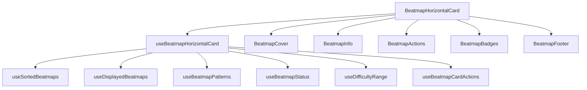

# BeatmapHorizontalCard Molecule

The `BeatmapHorizontalCard` is a complex molecule that displays beatmap information in a horizontal card format. It has been refactored following atomic design principles for better maintainability and reusability.

## 🏗️ Architecture

### Component Structure
```
BeatmapHorizontalCard/
├── BeatmapHorizontalCard.tsx     # Main component
├── BeatmapCover/                 # Cover image sub-component
├── BeatmapInfo/                  # Information display
├── BeatmapActions/               # Action buttons
├── BeatmapBadges/                # Badge management
├── BeatmapFooter/                # Footer information
└── README.md                     # This documentation
```

### Data Flow


## 🧩 Sub-components

### BeatmapCover
**Purpose**: Displays the beatmap cover image with overlay
**Props**:
- `beatmapset: BeatmapsetCompleteShort`
- `className?: string`

**Features**:
- Responsive image display
- Hover scale effect
- Dark overlay for text readability
- Fallback image support

### BeatmapInfo
**Purpose**: Shows main beatmap information
**Props**:
- `beatmapset: BeatmapsetCompleteShort`
- `className?: string`

**Features**:
- Artist and title display
- Creator information
- Text truncation for long names
- Responsive typography

### BeatmapActions
**Purpose**: Handles user actions (download)
**Props**:
- `beatmapset: BeatmapsetCompleteShort`
- `onDownload: (e: React.MouseEvent) => void`
- `className?: string`

**Features**:
- Slide-in download button
- Hover animations
- Event propagation control
- Accessibility support

### BeatmapBadges
**Purpose**: Manages difficulty and pattern badges
**Props**:
- `displayedMaps: BeatmapCompleteShort[]`
- `remainingCount: number`
- `uniquePatterns: string[]`
- `className?: string`

**Features**:
- Difficulty badges with color coding
- Pattern badges with shortcuts
- Remaining count indicator
- Responsive layout

### BeatmapFooter
**Purpose**: Displays status and difficulty range
**Props**:
- `priorityStatus: BeatmapStatus`
- `minRating: number`
- `maxRating: number`
- `className?: string`

**Features**:
- Status badge with icons
- Difficulty range display
- Positioned at bottom-right
- Consistent styling

## 🪝 Hooks Used

### useBeatmapHorizontalCard
**Purpose**: Main orchestration hook
**Returns**:
```typescript
{
  displayedMaps: BeatmapCompleteShort[];
  remainingCount: number;
  uniquePatterns: string[];
  priorityStatus: BeatmapStatus;
  difficultyRange: { minRating: number; maxRating: number } | null;
  handleClick: () => void;
  handleDownload: (e: React.MouseEvent) => void;
}
```

### useBeatmapCardActions
**Purpose**: Handles card interactions
**Parameters**:
- `beatmapset: BeatmapsetCompleteShort`
- `sortedMaps: BeatmapCompleteShort[]`

**Returns**:
```typescript
{
  handleClick: () => void;
  handleDownload: (e: React.MouseEvent) => void;
}
```

### Atomic Hooks
- `useSortedBeatmaps` - Sorts beatmaps by difficulty
- `useDisplayedBeatmaps` - Limits displayed beatmaps (max 5)
- `useBeatmapPatterns` - Extracts unique patterns (max 3)
- `useBeatmapStatus` - Determines priority status
- `useDifficultyRange` - Calculates difficulty range

## 🎨 Styling

### CSS Classes
```css
.beatmap-card {
  @apply card bg-base-100 shadow-xl hover:shadow-2xl 
         transition-all duration-300 cursor-pointer 
         group h-32 overflow-hidden relative;
}

.beatmap-content {
  @apply relative h-full p-4 flex flex-col 
         justify-between text-white;
}
```

### Responsive Design
- **Mobile**: Single column layout
- **Tablet**: Optimized spacing
- **Desktop**: Full hover effects

### Animations
- **Hover**: Shadow increase, image scale
- **Download button**: Slide-in from right
- **Transitions**: 300ms duration for smooth effects

## 🚀 Usage

### Basic Usage
```tsx
import { BeatmapHorizontalCard } from '@/components/molecules';

<BeatmapHorizontalCard beatmapset={beatmapset} />
```

### With Event Handlers
```tsx
const handleBeatmapClick = (beatmapset: BeatmapsetCompleteShort) => {
  // Navigate to beatmap details
};

const handleDownload = (beatmapset: BeatmapsetCompleteShort) => {
  // Download beatmap
};

<BeatmapHorizontalCard 
  beatmapset={beatmapset}
  onClick={handleBeatmapClick}
  onDownload={handleDownload}
/>
```

### In a List
```tsx
{beatmapsets.map(beatmapset => (
  <BeatmapHorizontalCard 
    key={beatmapset.beatmapset?.osu_id}
    beatmapset={beatmapset}
  />
))}
```

## 🔧 Customization

### Custom Styling
```tsx
<BeatmapHorizontalCard 
  beatmapset={beatmapset}
  className="custom-card-class"
/>
```

### Custom Actions
```tsx
const customActions = {
  onDownload: (e: React.MouseEvent) => {
    e.stopPropagation();
    // Custom download logic
  }
};
```

## 🧪 Testing

### Test Cases
- **Rendering**: Component renders with valid data
- **Interactions**: Click and download handlers work
- **Responsive**: Layout adapts to different screen sizes
- **Accessibility**: Keyboard navigation and screen readers
- **Performance**: Memoization prevents unnecessary re-renders

### Test Examples
```typescript
describe('BeatmapHorizontalCard', () => {
  it('renders beatmap information correctly', () => {
    render(<BeatmapHorizontalCard beatmapset={mockBeatmapset} />);
    expect(screen.getByText('Artist - Title')).toBeInTheDocument();
  });

  it('handles click events', () => {
    const handleClick = jest.fn();
    render(<BeatmapHorizontalCard beatmapset={mockBeatmapset} onClick={handleClick} />);
    fireEvent.click(screen.getByRole('button'));
    expect(handleClick).toHaveBeenCalled();
  });
});
```

## 📊 Performance

### Optimizations
- **Memoization**: All calculations are memoized
- **Lazy loading**: Images load on demand
- **Event delegation**: Efficient event handling
- **Virtual scrolling**: For large lists

### Bundle Size
- **Main component**: ~2KB
- **Sub-components**: ~1KB each
- **Hooks**: ~0.5KB each
- **Total**: ~8KB (minified)

## 🐛 Troubleshooting

### Common Issues
1. **Missing cover image**: Check fallback image path
2. **Pattern parsing errors**: Validate pattern data format
3. **Performance issues**: Check memoization dependencies
4. **Styling conflicts**: Verify CSS class specificity

### Debug Mode
```tsx
<BeatmapHorizontalCard 
  beatmapset={beatmapset}
  debug={true} // Enables console logging
/>
```

## 📚 Related Documentation

- [Atoms Documentation](../../atoms/README.md)
- [Hooks Documentation](../../hooks/README.md)
- [Beatmap Types](../../types/beatmap.md)
- [Design System Guide](../../design-system.md)
