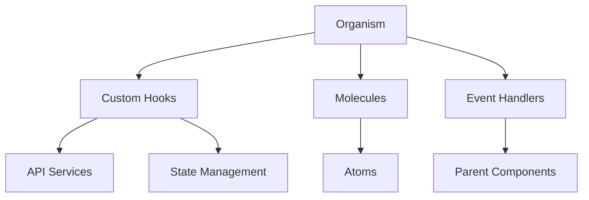

# Organisms Documentation

Organisms are complex UI components that combine molecules and atoms to form distinct sections of an interface. They represent complete functional units with their own business logic.

## 📋 Available Organisms

### Beatmap Organisms
- [BeatmapList](./BeatmapList.md) - Complete beatmap listing with filters
- [BeatmapMSDView](./BeatmapMSDView.md) - MSD analysis and visualization
- [RandomBeatmapList](./RandomBeatmapList.md) - Random beatmap generator

### Navigation Organisms
- [Navbar](./Navbar.md) - Main site navigation
- [ThemeManager](./ThemeManager.md) - Theme switching and management

## 🎯 Design Principles

### Composition
Organisms are built by combining molecules and atoms:
- **Multiple molecules** work together
- **Complex business logic** and state management
- **Complete functionality** for specific use cases
- **Self-contained** with minimal external dependencies

### State Management
```typescript
interface OrganismProps {
  // Data props
  data: ComplexDataType;
  
  // Configuration
  config?: OrganismConfig;
  
  // Event handlers
  onAction?: (data: ProcessedData) => void;
  
  // State management
  initialState?: Partial<OrganismState>;
}
```

### Data Flow


## 🧩 BeatmapList Organism

### Purpose
Complete beatmap listing with filtering, sorting, and pagination capabilities.

### Components Used
- `BeatmapHorizontalCard` - Individual beatmap display
- `FilterSection` - Filter controls
- `DifficultyButtons` - Difficulty selection
- `RateSelector` - Rate selection
- `Badge` - Status indicators
- `Button` - Action buttons

### Features
- **Filtering**: By difficulty, patterns, status
- **Sorting**: By rating, date, popularity
- **Pagination**: Virtual scrolling for performance
- **Search**: Real-time search functionality
- **Responsive**: Mobile-first design

### State Management
```typescript
interface BeatmapListState {
  beatmaps: BeatmapCompleteShort[];
  filters: BeatmapFilters;
  sortBy: SortOption;
  isLoading: boolean;
  error: string | null;
  pagination: PaginationState;
}
```

## 🧩 BeatmapMSDView Organism

### Purpose
Comprehensive MSD (Mania Skill Difficulty) analysis and visualization.

### Components Used
- `MSDRadarChart` - Skill radar visualization
- `MSDRatesLineChart` - Rate progression charts
- `BeatmapHeader` - Beatmap information
- `DifficultyBadge` - Difficulty indicators
- `Button` - Action controls

### Features
- **Radar Chart**: Multi-dimensional skill analysis
- **Line Charts**: Rate progression over time
- **Interactive**: Hover and click interactions
- **Export**: Data export functionality
- **Comparison**: Multiple beatmap comparison

### Data Processing
```typescript
interface MSDViewData {
  beatmap: BeatmapCompleteShort;
  msdData: MSDData;
  rates: RateData[];
  comparison?: BeatmapCompleteShort[];
}
```

## 🧩 RandomBeatmapList Organism

### Purpose
Random beatmap generation with customizable criteria.

### Components Used
- `BeatmapHorizontalCard` - Beatmap display
- `FilterSection` - Generation criteria
- `Button` - Generate and refresh actions
- `Badge` - Status indicators

### Features
- **Random Generation**: Based on criteria
- **Criteria Selection**: Difficulty, patterns, status
- **Batch Generation**: Multiple beatmaps at once
- **Favorites**: Save generated beatmaps
- **History**: Track generation history

### Generation Logic
```typescript
interface GenerationCriteria {
  difficultyRange: [number, number];
  patterns: string[];
  status: BeatmapStatus[];
  count: number;
  excludePlayed: boolean;
}
```

## 🧩 Navbar Organism

### Purpose
Main site navigation with responsive design and theme switching.

### Components Used
- `Button` - Navigation links
- `ThemeSwitcher` - Theme toggle
- `Badge` - Notification indicators
- `Image` - Logo display

### Features
- **Responsive**: Mobile hamburger menu
- **Theme Toggle**: Dark/light mode switching
- **Active States**: Current page indication
- **Notifications**: Badge indicators
- **Accessibility**: Keyboard navigation

### Navigation Structure
```typescript
interface NavigationItem {
  label: string;
  path: string;
  icon?: React.ComponentType;
  badge?: number;
  children?: NavigationItem[];
}
```

## 🧩 ThemeManager Organism

### Purpose
Global theme management with persistence and system preference detection.

### Components Used
- `ThemeSwitcher` - Theme toggle button
- `Button` - Theme selection buttons

### Features
- **Theme Persistence**: Local storage
- **System Detection**: Auto-detect system preference
- **Smooth Transitions**: CSS transitions
- **Custom Themes**: Extensible theme system
- **Accessibility**: High contrast support

### Theme Configuration
```typescript
interface ThemeConfig {
  name: string;
  colors: ColorPalette;
  typography: TypographyConfig;
  spacing: SpacingConfig;
  breakpoints: BreakpointConfig;
}
```

## 🚀 Usage Guidelines

### Import Pattern
```typescript
import { 
  BeatmapList, 
  BeatmapMSDView, 
  RandomBeatmapList,
  Navbar,
  ThemeManager
} from '@/components/organisms';
```

### Component Composition
```typescript
// Example: Complete beatmap page
const BeatmapPage = () => {
  return (
    <div className="beatmap-page">
      <Navbar />
      <main>
        <BeatmapList 
          initialFilters={defaultFilters}
          onBeatmapSelect={handleBeatmapSelect}
        />
      </main>
    </div>
  );
};
```

### State Management
```typescript
// Example: Using organisms with external state
const App = () => {
  const [theme, setTheme] = useState('light');
  const [beatmaps, setBeatmaps] = useState([]);

  return (
    <ThemeProvider theme={theme}>
      <ThemeManager onThemeChange={setTheme} />
      <BeatmapList 
        beatmaps={beatmaps}
        onBeatmapsChange={setBeatmaps}
      />
    </ThemeProvider>
  );
};
```

## 📊 Component Matrix

| Component | Molecules Used | Props | Events | State | API Calls |
|-----------|----------------|-------|--------|-------|-----------|
| BeatmapList | 5+ | beatmaps, filters | onSelect, onFilter | ✅ | ✅ |
| BeatmapMSDView | 3+ | beatmap, msdData | onExport, onCompare | ✅ | ✅ |
| RandomBeatmapList | 3+ | criteria, count | onGenerate, onSave | ✅ | ✅ |
| Navbar | 2+ | navigation, theme | onNavigate, onTheme | ❌ | ❌ |
| ThemeManager | 1+ | themes, current | onThemeChange | ✅ | ❌ |

## 🔧 Development

### File Structure
```
organisms/
├── ComponentName/
│   ├── ComponentName.tsx
│   ├── hooks/
│   │   ├── useComponentName.ts
│   │   └── index.ts
│   ├── types/
│   │   ├── ComponentName.types.ts
│   │   └── index.ts
│   ├── utils/
│   │   ├── componentName.utils.ts
│   │   └── index.ts
│   ├── index.ts
│   └── README.md
├── index.ts
└── README.md
```

### Custom Hooks
Organisms often use complex custom hooks:
```typescript
// Example: Complex organism hook
const useBeatmapList = (initialFilters: BeatmapFilters) => {
  const [state, setState] = useState<BeatmapListState>({
    beatmaps: [],
    filters: initialFilters,
    sortBy: 'rating',
    isLoading: false,
    error: null,
    pagination: { page: 1, limit: 20, total: 0 }
  });

  const { data, error, isLoading } = useBeatmapListQuery(state.filters);
  
  const handleFilterChange = useCallback((newFilters: BeatmapFilters) => {
    setState(prev => ({ ...prev, filters: newFilters, page: 1 }));
  }, []);

  const handleSortChange = useCallback((sortBy: SortOption) => {
    setState(prev => ({ ...prev, sortBy }));
  }, []);

  return {
    ...state,
    handleFilterChange,
    handleSortChange,
    data,
    error,
    isLoading
  };
};
```

### Testing Strategy
- **Integration tests** for complete functionality
- **E2E tests** for user workflows
- **Performance tests** for large datasets
- **Accessibility tests** for keyboard navigation
- **Visual regression tests** for UI consistency

## 📚 Related Documentation

- [Atoms Documentation](../atoms/README.md)
- [Molecules Documentation](../molecules/README.md)
- [Hooks Documentation](../hooks/README.md)
- [API Services Documentation](../services/README.md)
- [State Management Guide](../state-management.md)
